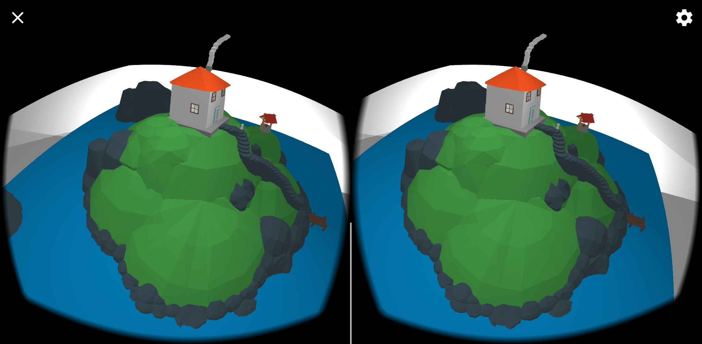
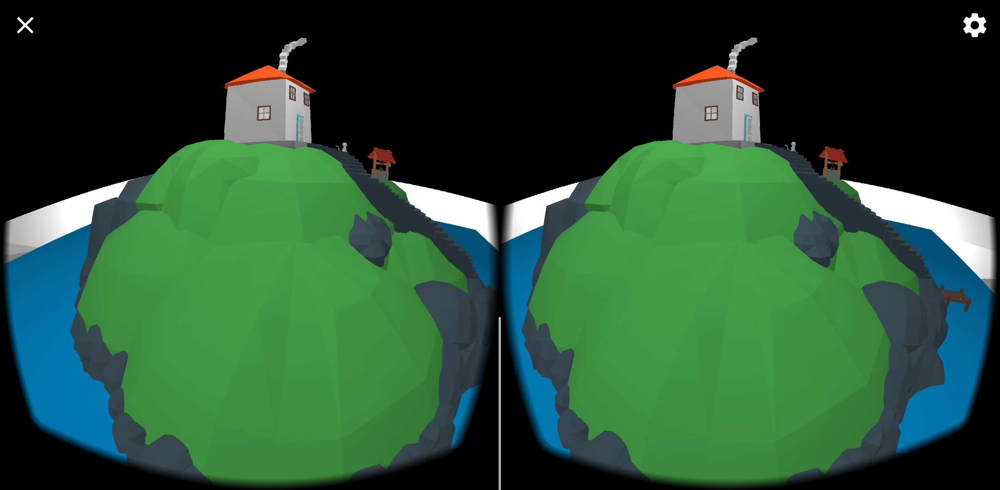
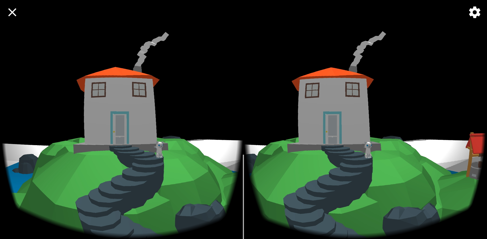

# VR Demo

A demo to demonstrate how to build a VR app in cardboard using [google-vr](https://github.com/googlevr/gvr-android-sdk) and [ARCore](https://github.com/google-ar/arcore-android-sdk)







## How to use

1. Build it in Android Studio or download it from release
2. Install it (Android API >= 24 is required)
3. Give it your permission to your device's camera
4. Setup your Cardboard, use volume key to adjust your base Y axis
5. Move around and enjoy it! 

## License

The [MediaLab Island](https://poly.google.com/view/8pbArn70zK3) and [Cube Room](https://poly.google.com/view/1fahMeqZOw_) models credit to [Wesley Oliveira](https://poly.google.com/user/c36U2gan4pw) and [Anonymous](https://poly.google.com/user/f8cGQY15_-g), respectively.


```
Copyright 2019 Jiewen Lai

Licensed under the Apache License, Version 2.0 (the "License");
you may not use this file except in compliance with the License.
You may obtain a copy of the License at

    http://www.apache.org/licenses/LICENSE-2.0

Unless required by applicable law or agreed to in writing, software
distributed under the License is distributed on an "AS IS" BASIS,
WITHOUT WARRANTIES OR CONDITIONS OF ANY KIND, either express or implied.
See the License for the specific language governing permissions and
limitations under the License.
```


